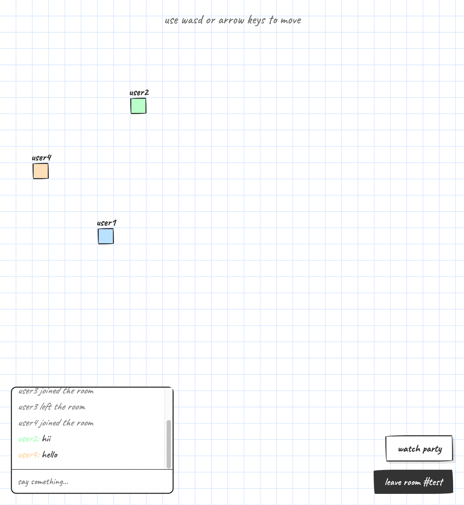
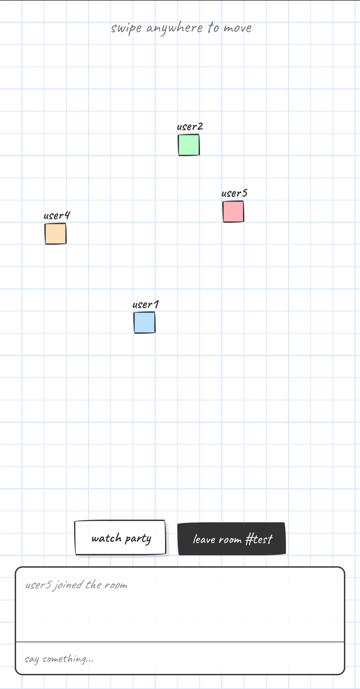
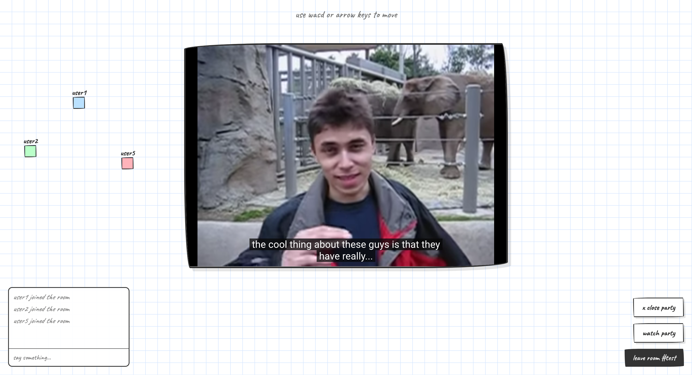

# hangout

### Live Site: https://hangout-pkgx.onrender.com

A lightweight, 2D virtual space where you can move around your character and have a live group chat with friends who joined using the same room code, anyone can start a youtube watch party for everyone to watch.

 

<table>
   <tr>
      <td><b>Frontend</b></td>
      <td>HTML, CSS, JavaScript</td>
   </tr>
   <tr>
      <td><b>Backend</b></td>
      <td>Node.js, Express.js</td>
   </tr>
   <tr>
      <td><b>Tools</b></td>
      <td>Socket.io, YouTube IFrame Player API</td>
   </tr>
</table>

 

 

